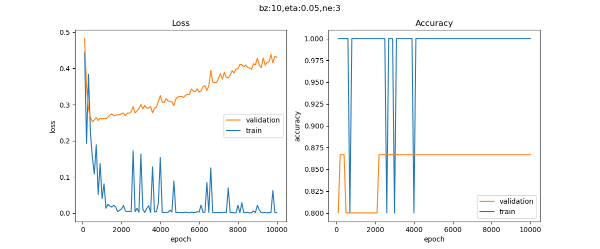

# 神经网络项目文档

​		微软的神经网络简明教程以案例为线索，向读者逐步展开神经网络的层层发展，不仅有严谨的数学推导也有详尽的代码分析，更有令人印象深刻的对神经网络变换的可视化分析，是很棒的教程，唯一令笔者感觉有些别扭的是在求梯度的数学推导过程中，该教程并没有用微积分中严格的梯度和jacobian矩阵等表示方式。

​		本文作者主要学习了卷积神经网络之前的内容，从线性回归到多分类线性回归，以下为笔者在做课后项目时得到的结果：

## 一、利用神经网络来对mlm.csv中的数据做线性回归（代码在文件夹edition1中,主过程在mlm_solution中）

作者之一张冀根据教程给出的代码做了较大幅度的修改，比如新加了一个子类来读取csv的文件以及把一些功能比如denormalize封装成类，另一个作者邵彦骏根据教程写了一份自己的代码：

以下为作者一的结果分析：

下图是代码跑出的结果的可视化：

下图是用神经网络跑出的结果：

​下图是用正规方程法求得得结果：

	

从上至下依次是B，W1和W2

可见两者的差距是很小的！

## 二、利用神经网络对iris.csv中的数据做非线性分类（代码在文件夹edition2中，主过程在iris_solution.py中）

作者做的工作主要是阅读理解现有的代码并且增添一些小的功能，把一些不兼容的地方的bug处理掉（比如在test过程中对数据的初始化的代码做修改）

Eta设为0.05的loss history和结果在figure1中：

Eta设为0.1的loss history和结果在figure2中

该代码中把测试集就设为原来的集合，两者结果差距并不是很大，并且accuracy都在0.95以上，可以说训练出来的结果都是有效的。
